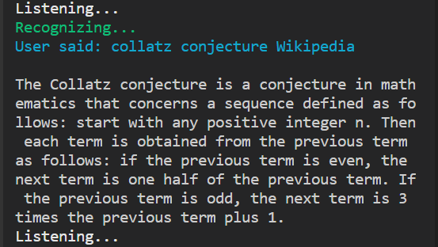

# Project Anton

Anton is a Virtual Assistant constructed and coded by the Cornerstone Team, it helps with common tasks such as searching Wikipedia with voice command, Playing Music, Password Generation, Graph Plotting, Getting Time and Weather and Launching Applications.

## Installation

Download the zipped file of the project from this repository.


Alternatively, clone the repository using the following command in your terminal.

```bash
git clone https://github.com/Cornerstone-CJ/virtual-assistant-CJ.git
```

## Usage

Copy and paste the following code in your terminal then press enter.

```bash
pip install pyowm
pip install SpeechRecognition
pip install wikipedia
pip install pyttsx3
pip install --user pywin 
pywin install pyaudio 
pip install pyowm
pip install matplotlib
pip install pygame 
pip install termcolor 
```

Run the anton.py file

### Searching Wikipedia

Say what you want to search wikipedia for with Wikipedia at the end of your sentence. For example;



### Password Generation

Use the command "Generate Password". For example;


### To play music

Use the command "Play music". For example;


### Getting the Time

Use the command "What time is it?".

### Getting the Weather

Use the command "What is the Weather?".

### Graph Plotting

Use the command "Plot graph". Note that you have to close the graph window for Anton to continue listening.

### Launching Applications (Only availaible for Windows)

#### Teams

Use the command "Open Teams".

#### Discord

Use the command "Open Discord".

#### PyCharm

Use the command "Open PyCharm".

#### Calculator

Use the command "Open Calculator".

### Launching Websites

#### Google

Use the command "Launch Google".

#### Netflix

Use the command "Launch Netflix".

#### Youtube

Use the command "Launch Youtube".

#### Udemy

Use the command "Launch Udemy"

### To play a game of Rock Paper Scissors

Use the command "Rock Paper Scissors".

#### Sample Games


### Jokes

Use any of the commands -> "Joke", "Jokes" or " "Tell me a joke" to hear a random joke from Anton.

### To tell Anton to stop listening to commands

Use the command "Stop listening".

### To tell Anton to resume listening to commands

Use the command "Continue listening" or "Resume listening".

### To tell Anton to stop completely

Use any of the the commands -> "Quit", "Leave", "Close", or "Bye".
