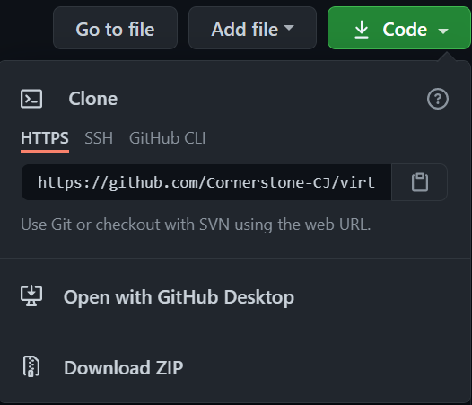

# Project Anton

Anton is a Virtual Assistant for that helps with common tasks such as searching Wikipedia with voice command, Playing Music, Password Generation, Graph Plotting, Getting Time and Weather and Launching Applications.

## Installation

Download the zipped file of the project from this repository.



Alternatively, clone the repository using the following command in your terminal.

```bash
git clone https://github.com/Cornerstone-CJ/virtual-assistant-CJ.git
```

## Usage

Run the program in your editor or using a terminal and wait about 5 seconds after the introduction from Anton.

### Searching Wikipedia

Say what you want to search wikipedia for with Wikipedia at the end of your sentence. For example;


### Password Generation

Use the command "Generate Password". For example;


### To play music

Use the command "Play music"

### Getting the Time

Use the command "What time is it".

### Getting the Weather

Use the command "What is the Weather".

### Graph Plotting

Use the command "Plot Graph"

### Launching Applications (Only availaible for Windows OS)

#### Teams

Use the command "Open Teams".

#### PyCharm

Use the command "Open PyCharm".

#### Calculator

Use the command "Open Calculator".

### Launching Websites

#### Netflix

Use the command "Launch Netflix".

#### Youtube

Use the command "Launch Youtube".

#### Udemy

Use the command "Launch Udemy"

### To play a game of Rock Paper Scissors

Use the command "Rock Paper Scissors".

#### Sample Games


### To tell Anton to stop listening to commands

Use the command "Stop listening"

### To tell Anton to resume listening to commands

Use the command "Continue listening" or "Resume listening"

### To tell anton to stop completely

Use any of the the commands -> "Quit", "Leave", "Close", or "Bye"
